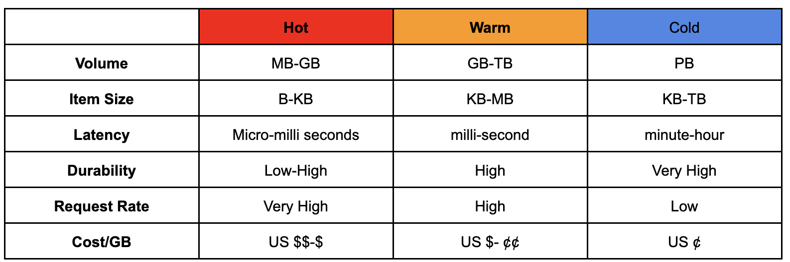
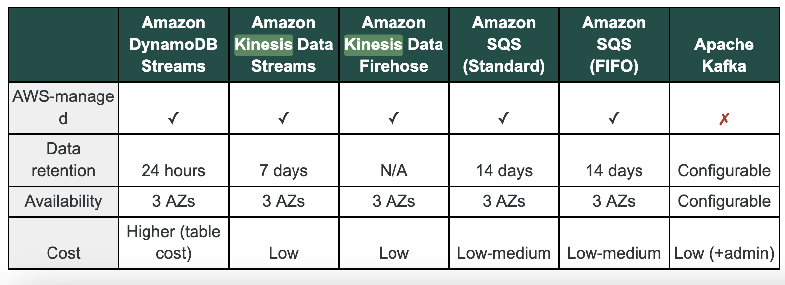

# Kinesis
## Kinesis Data Stream (KDS)
Serverless streaming data service that makes it easy to capture, process, and store data streams at any scale.

## Kinesis Data Firehose (KDF):
Kinesis Firehose is easiest way to capture, transform, and load data streams into AWS data stores for near real-time analytics with existing business intelligence tools.
-   Load stream into S3, Redshift, ElasticSearch and Splunk

## Kinesis Data Analytics (KDA)
Kinesis Data Analytics is the easiest way to process data streams in real time with SQL or Apache Flink without having to learn new programming languages or processing frameworks.

**Characteristics of hot, warm, and cold data**

**Comparison between different data collection services**
