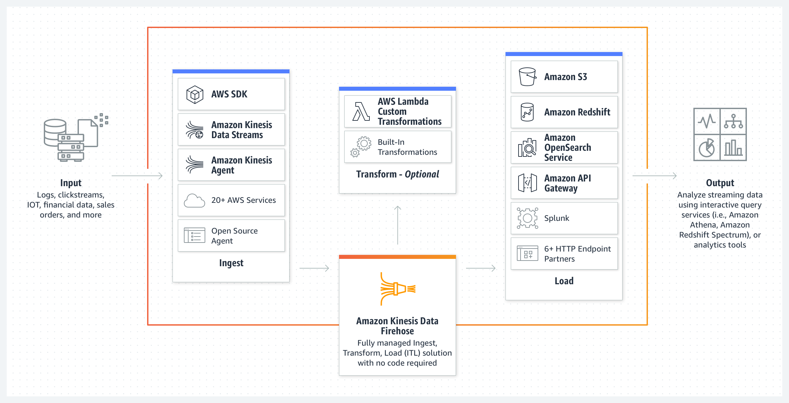

# Kinesis Firehose

Kinesis Data Firehose is a streaming ETL solution. It is the easiest way to load streaming data into data stores and analytics tools. It can capture, transform, and load streaming data into Amazon S3, Amazon Redshift, Amazon OpenSearch Service, and Splunk, enabling near real-time (60 seconds latency minimum) analytics with existing business intelligence tools and dashboards you’re already using today. It is a fully managed service that automatically scales to match the throughput of your data and requires no ongoing administration. It can also batch, compress, and encrypt the data before loading it, minimizing the amount of storage used at the destination and increasing security.

### Kinesis Firehose Source
- Amazon Kinesis Data Firehose API
- Kinesis Data Stream
- AWS natively supported Service like AWS Cloudwatch, AWS EventBridge, AWS IOT, or AWS Pinpoint
- Kinesis Agents
- Fluentbit (open source Log Processor and Forwarder)
- AWS Lambda 

### Kinesis Firehose Destinations
- S3
- Amazon Redshift 
- Amazon OpenSearch Service 
- Splunk
- Datadog, NewRelic, Dynatrace, Sumologic, LogicMonitor, MongoDB, and HTTP End Point

**Record:** A record is the data of interest your data producer sends to a delivery stream. The maximum size of a record (before Base64-encoding) is 1024 KB.

*When a Kinesis Data Stream is configured as the source of a Kinesis Data Firehose delivery stream, Firehose’s PutRecord and PutRecordBatch operations will be disabled.*

### Data Transformation and Format Conversion
-  Built-in data format conversion from data raw or Json into formats like Apache Parquet and Apache ORC required by your destination data stores.
- dynamically partition your streaming data before delivery to S3 using static or dynamically defined keys like “customer_id” or “transaction_id”
- groups data by keys and delivers into key-unique S3 prefixes
- Use an AWS Lambda function to prepare and transform incoming raw data in your delivery stream before loading it to destinations. You can configure an AWS Lambda function for data transformation when you create a new delivery stream or when you edit an existing delivery stream.
- Supports GZIP, ZIP, and SNAPPY compression formats. Only GZIP is supported if the data is further loaded to Amazon Redshift.
- If you use data transformation with Lambda, you can enable source record backup, and Amazon Kinesis Data Firehose will deliver the un-transformed incoming data to a separate S3 bucket.

### Delivery
- Kinesis Data Firehose can back up all un-transformed records to your S3 bucket concurrently while delivering transformed records to destination. Source record backup can be enabled when you create or update your delivery stream.
- The frequency of data delivery to Amazon S3 is determined by the S3 buffer size (1 MB to 128 MB) and buffer interval (60 to 900 seconds) you configured for your delivery stream.
- Amazon Kinesis Data Firehose access to your Redshift cluster by unblocking Firehose IP addresses from your VPC.
- Amazon Kinesis Data Firehose delivers data to your Amazon S3 bucket first and then issues Redshift COPY command to load data from your S3 bucket to your Redshift cluster.
- Kinesis Data Firehose can rotate your Amazon OpenSearch Service index based on a time duration. You can configure this time duration while creating your delivery stream.
- When loading data into Amazon OpenSearch Service, Kinesis Data Firehose can back up all of the data or only the data that failed to deliver. To take advantage of this feature and prevent any data loss, you need to provide a backup Amazon S3 bucket.
- You can change the configuration of your delivery stream at any time after it’s created. 
- Your Kinesis Data Firehose delivery stream and destination Amazon OpenSearch Service domain need to be in the same account.
- Your Kinesis Data Firehose delivery stream and destination Amazon OpenSearch Service domain need to be in the same region.
- For Amazon Redshift destination, Amazon Kinesis Data Firehose generates manifest files to load Amazon S3 objects to Redshift cluster in batch. The manifests folder stores the manifest files generated by Firehose.
- A single delivery stream can only deliver data to one Amazon S3 bucket currently. If you want to have data delivered to multiple S3 buckets, you can create multiple delivery streams.
- A single delivery stream can only deliver data to one Amazon Redshift cluster and one table currently. If you want to have data delivered to multiple Redshift clusters or tables, you can create multiple delivery streams.
- A single delivery stream can only deliver data to one Amazon OpenSearch Service domain and one index currently. If you want to have data delivered to multiple Amazon OpenSearch domains or indexes, you can create multiple delivery streams.
- Amazon Kinesis Data Firehose uses at least once semantics for data delivery. In rare circumstances such as request timeout upon data delivery attempt, delivery retry by Firehose could introduce duplicates if the previous request eventually goes through.
- The errors folder stores manifest files that contain information of S3 objects that failed to load to your Amazon Redshift cluster. You can reload these objects manually through Redshift COPY command. 

### Firehose Buffer Sizing
- Firehose accumulates records in a buffer
- The buffer is flushed based on time and size rules
- Buffer Size (ex: 32MB): if that buffer size is reached, it’s flushed
- Buffer Time (ex: 2 minutes): if that time is reached, it’s flushed
- Firehose can automatically increase the buffer size to increase throughput
    - High throughput => Buffer Size will be hit
    - Low throughput => Buffer Time will be hit

### Security
- Kinesis Data Firehose allows you to encrypt your data after it’s delivered to your Amazon S3 bucket. While creating your delivery stream, you can choose to encrypt your data with an AWS Key Management Service (KMS) key that you own.*
- Kinesis Data Firehose assumes the IAM role you specify to access resources such as your Amazon S3 bucket and Amazon OpenSearch domain*
