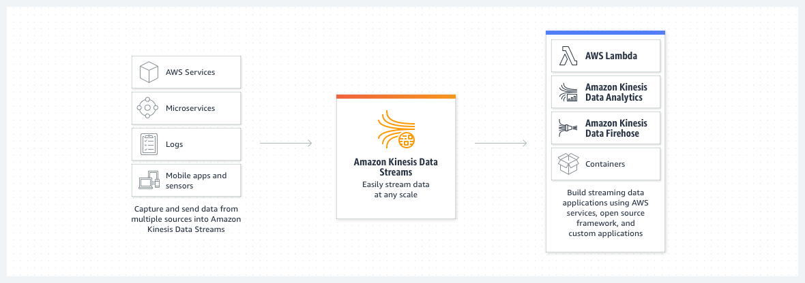
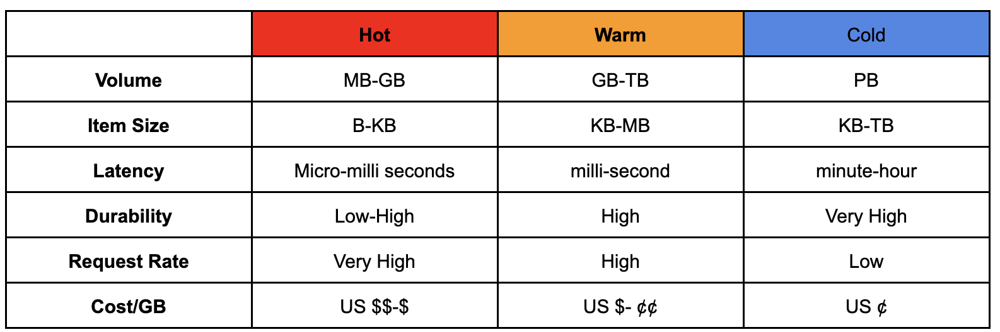
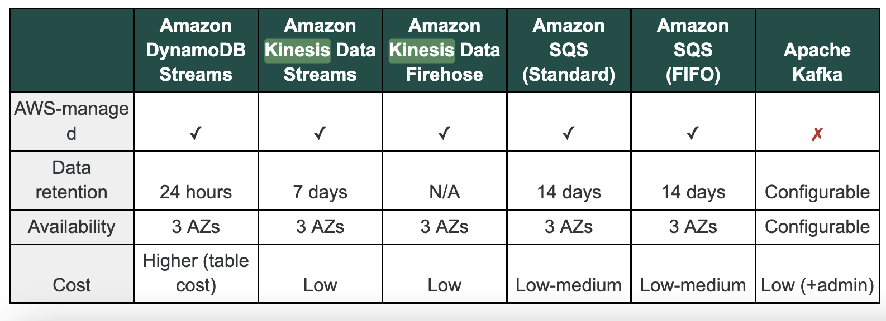

# Kinesis Data Stream (KDS)
- Serverless streaming data service that makes it easy to capture, process, and store data streams at any scale.
- Kinesis Data Streams is for use cases that require custom processing, choice of stream processing frameworks, and sub-second processing latency. 
- Kinesis Data Streams synchronously replicates data across three Availability Zones (high availability and data durability) in an AWS Region. Kinesis Data Streams is not suited for data persistence or for long-term data storage. However, data will be retained for 24 hours and you can extend the retention period by up to 7 days.
- Each shard can support up to 5 transactions per second for reads, up to a maximum total data read rate of 2 MB per second and up to 1,000 records per second for writes, up to a maximum total data write rate of 1 MB per second (including partition keys). The total capacity of the stream is the sum of the capacities of its shards.
- Enhanced Fan-out support 2MB/s per consumer per Shard. No API call needed. Support push model over HTTP/s
- You pay per shard hour and per PUT payload unit. Optionally, there are fees associated with extended data retention and enhanced fan-out, if you choose to use those features.
- At-least once data delivery, Guarnteed ordering
- Once data inserted into Kinesis, it can not be deleted or modified.
- Use Case: 
    - Accelerated log and data feed intake
    - Real-time metrics and reporting
    - Real-time data analytics
    - Log and event data collection
    - Power event-driven applications
    - clickstreams, and social media from hundreds of thousands of sources

**Characteristics of hot, warm, and cold data**

**Comparison between different data collection services**

### Managed AWS sources for KDS
- Cloud Watch Logs
- AWS IoT
- Kinesis Data Analytics

## Key concepts
##### Shard, Producer and Consumers
- Base throughput unit
- Supports 1 MB/second and 1,000 records per second for writes
- Supports 2 MB/second for reads
- Producer puts data records into shards and a consumer gets data records from shards.
- Consumers consuming data in the exact order in which they are stored
- Producer and consumer applications will receive throttles error when limit exceed.

**Record:** A record is composed of a sequence number, partition key, and data blob.The maximum size of a data blob in 1MB

**Sequence number:** Unique identifier for each record. Sequence number is assigned by Amazon Kinesis when a data producer calls PutRecord or PutRecords operation to add data to a Amazon Kinesis data stream.

**Capacity Mode:** Provisioned (best suited for predictable traffic) and on-demand (AWS manages the shards to provide the necessary throughput, best suited for workloads with unpredictable and highly variable traffic patterns) modes. You can switch between on-demand and provisioned mode twice a day.

## Adding data to Kinesis Data Streams
**Amazon Kinesis SDK**
- Use PutRecord or PutRecords (many records)
- PutRecords increase throughput by making fewer HTTP request
- Good for low throughput, higher latency, simple API and Lambda

**Kinesis Producer Library (KPL)**
- Highly Configurable and easy to use (C++/java) library
- Used for high performance, long running producer
- Synchronous and Asynchronous (better performance) API
- Submit metrics to CloudWatch
- Batching(increase throughput, descrease cost)
    - Write to multiple shard in the same PutRecords API call
- Compression must be implemented by the user
- KPL records must be decoded with KCL or special helper library

*The KPL(Kinesis Producer Library) PutRecords operation often sends multiple records to the stream per request. If a single record fails, it is automatically added back to the KPL buffer and retried. The failure of one record does not impact the processing of other records in the request.*

**Amazon Kinesis Agent**
-  Monitor Log files and send them to KDS
-  Java based agent, built on top of KPL
-  Install in Linux based server environment
- Features:
    - Write from multiple directories and Write to multiple stream
    - Feature routing based on directy or log file
    - Pre-process data before sending to stream (CSV to JSON)
    - The agend handles file rotation, checkpointing and retry on failure
    - Emits metrics to CloudWatch for monitoring
- 3rd Party Libraries (Spark, Kafka Connect, Flume etc.)

## Reading and processing data
**Kinesis SDK**
- Records polled by consumer getRecords
- Each Shard has 2MB total aggregate throughput.
- getRecords return up to 10MB or 10K records(when throttled for 5 seconds)
- Max 5 API calls per shard per second

**Kinesis Client Library (KCL)**
- The KCL consumes and processes the data from a Kinesis data stream. The KCL also offers checkpointing, which means it stores a cursor in DynamoDB to durably track the records that have been read from a shard in a Kinesis stream. In the event that a KCL worker fails in the middle of reading data from the stream, KCL will be able to use that cursor and pick up from the exact spot where the failed application left off.
- Read records from Kinesis produced with KPL(de-aggregation)
- Share multiple shard with multiple consumers in one group (shard discovery)
- Two important things to remember:
    1. Since KCL creates DynamoDB tables on your behalf, it's important to use unique application names in KCL for each application. 
    2. You may run into provisioned throughput exception errors with DynamoDB if your stream has too many shards, or if the application does frequent checkpointing and there is not enough WCU/RCU 

**Kinesis Connector Library**
- Older Java Library
- Write data to S3, DynamoDB, Redshift and ElasticSearch(OpenSearch)
- Kinesis Firehose replaces the Connector Library for few of these target, Lambda for others

**3rd Party Library**

**Kinesis Firehose**

**AWS Lambda**
- Lambda Consumer has library to de-aggregate records from the KPL 
- Lambda can be used to run light ETL to S3, DynamoDB, Redshift and ElasticSearch(OpenSearch) etc.
- Lambda can be used to trigger notification/ Email in real time
- Lambda has configurable batch size 
- Kinesis Consumner Enhanced FanOut
    - Game changing features
    - Work wth KCL 2.0 and Lambda
    - Each Consumer get 2MS/s of provisioned throughput per shard
    - Push data to consumer over HTTP/2
    - Reduced Latency (~70ms)
**SubscribeToShard API**
The SubscribeToShard API uses the HTTP/2 protocol to deliver data to registered consumers whenever new data arrives on the shard, typically within 70 milliseconds, offering approximately 65% faster delivery compared to the GetRecords API.

*You can have multiple consumers using enhanced fan-out and others not using enhanced fan-out at the same time. The use of enhanced fan-out does not impact the limits of shards for traditional GetRecords usage.*

*To use SubscribeToShard, you need to register your consumers, which activates enhanced fan-out. By default, your consumer will use enhanced fan-out automatically when data is retrieved through SubscribeToShard.*

## provision Mode Scale Capacity
- Scale up a KDS capacity by splitting existing shards using the SplitShard API.
- Scale down capacity by merging two shards using the MergeShard API.
- Use UpdateShardCount API to scale up (or down) a stream capacity to a specific shard count
- ProvisionedThroughputExceeded exception when provisioned capacity limit exceeds
- Temporary rise of the data stream, retry by the Amazon Kinesis application will eventually lead to completion of the requests

### Kinesis Scaling limitation
- Resharding can not be done in parallel
- One resharding operation at a time and it takes few seconds
- for 1000 Shards it takes 30K seconds (8.3 Hours)
- You can’t do the following:
    - Scale more than twice for each rolling 24 hour period for each stream
    - Scale up to more than double your current shard count for a stream
    - Scale down below half your current shard count for a stream
    - Scale up to more than 500 shards in a stream
    - Scale a stream with more than 500 shards down unless the result is fewer than 500

## Kinesis Security
- Control access / authorization using IAM policies.
- Kinesis Data Streams integrates with Amazon CloudTrail
- Securely put and get your data from Kinesis through SSL endpoints using the HTTPS protocol.
- Server-side encryption with AWS Key Management Service (KMS) keys to encrypt data stored in data stream.
- Privately access Kinesis Data Streams APIs from your Amazon VPC by creating VPC Endpoints
- You can also write encrypted data to a data stream by encrypting and decrypting on the client side (manual, harder)
- Server-side encryption is free if you are not exceeding the AWS Free Tier KMS API usage costs

## Similar Service Comparision (SQS)
Amazon Kinesis Data Streams enables real-time processing of streaming big data. It provides ordering of records, as well as the ability to read and/or replay records in the same order to multiple Amazon Kinesis Applications. The Amazon Kinesis Client Library (KCL) delivers all records for a given partition key to the same record processor, making it easier to build multiple applications reading from the same Kinesis data stream (for example, to perform counting, aggregation, and filtering). Amazon Simple Queue Service (SQS) offers a reliable, highly scalable hosted queue for storing messages as they travel between computers. Amazon SQS lets you easily move data between distributed application components and helps you build applications in which messages are processed independently (with message-level ack/fail semantics), such as automated workflows.

