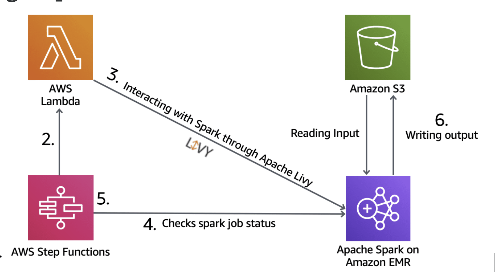

# EMR

Amazon EMR is a cloud big data platform for running large-scale distributed data processing jobs, interactive SQL queries, and machine learning (ML) applications using open-source analytics frameworks such as Apache Spark, Apache Hive, and Presto.

## Optimizing Amazon EMR Clusters
Depending on our workload, there are several approaches we can take to optimize our Amazon EMR cluster. Here is a list of Amazon EMR design considerations

- Instance right-sizing
- Amazon S3 vs local HDFS
- Transient vs persistent cluster
- Using spot instances
- Elastic Cluster Vs static Cluster

### Instance right-sizing
Launching several small clusters and running benchmark tests allows we to choose the most appropriate instance type for our workload. Amazon EMR supports Standard, High CPU, High Memory, Cluster Compute, High I/O, and High Storage instance types.

- General (M5 and M4 Family) - good for batch processing
- Compute (C5 and C4 Family) - good for machine learning
- Memory (X1 and R4 Family) - good for interactive analysis
- Storage (D5 and I3 Family) - Large HDFS

### Amazon S3 vs. local HDFS
HDFS is used by the master and core nodes. While HDFS provides fast performance, it is considered ephemeral storage that is reclaimed when the cluster is terminated. It is best used for caching the results produced by intermediate job-flow steps. HDFS is useful for the hottest data sets. 

Amazon EMRFS (Amazon S3) provides our cluster with a persistent data storage system. The benefit of using EMRFS is that we get persistence along with Amazon S3 features like server-side encryption, read-after-write consistency, and list consistency. While EMRFS provides fast performance, HDFS is used for the hottest data sets. 

### Transient vs. persistent clusters
You can lower the operational cost of our solution by running the Amazon EMR cluster only when it is needed. Remember that Amazon EMR clusters are made up of Amazon Elastic Compute Cloud (Amazon EC2) nodes that are billed by the second. 

A global solution that ingests data 24/7 might not provide an opportunity for a transient cluster. However, if you have a question that involves business analysts doing work on a set schedule, then a transient cluster will likely be part of the answer.

Transient cluster terminate once all steps are completed. Persistent clusters are normally by default auto-termination off.

### Using Spot instances
Another way to reduce costs is to run Amazon EMR using Spot instances. Depending on whether we use **uniform instance groups or instance fleets** for our cluster configuration, Spot instance options will differ. 

With uniform instance groups, we specify a maximum Spot price and a single Spot instance type. All instances in the group must be Spot instances.

With instance fleets, we set a target capacity for Spot and On-Demand instances and up to five different instance types. Amazon EMR will provision instances until the target capacity for each target is fulfilled. You can also use a weighted capacity for each instance type or use vCPU of the instance type. This will count toward our target capacity when an instance of that type is provisioned. 

Since core nodes run HDFS and task nodes do not, Amazon EMR task nodes are ideal for Spot instances. In this case, if the Spot price increases and we lose task nodes, we will not lose data stored in HDFS.

### Elastic cluster vs. static cluster
We can adjust the number of Amazon EC2 instances available to an Amazon EMR cluster automatically or manually in response to workloads that have varying demands. Here are our options for adding and removing capacity: 

We can configure automatic scaling for the core instance group and task instance groups when we first create them or after the cluster is running. Amazon EMR automatically configures Amazon EC2 Auto Scaling parameters according to rules we specify, and then adds and removes instances based on an Amazon CloudWatch metric.

We can manually resize the core instance group and task instance groups by manually adding or removing Amazon EC2 instances.

We can add a new task instance group to the cluster.

### EMR and AWS integration
- Amazon EC2 for the instances that comprise the nodes in the cluster
- Amazon Virtual Private Cloud (Amazon VPC) to configure the virtual network in which you launch your instances
- Amazon S3 to store input and output data
- Amazon CloudWatch to monitor cluster performance and configure alarms
- AWS Identity and Access Management (IAM) to configure permissions
- AWS CloudTrail to audit requests made to the service
- AWS Data Pipeline to schedule and start your clusters
- AWS Lake Formation to discover, catalog, and secure data in an Amazon S3 data lake
- DynamoDB, Redshift, RDS and Aurora as data source/ Target
- AWS Glue Data Catelog as managed meta data repository and altenate to hive metastore

## EMR
- Master, core and task nodes, each in instance groups. Up to 50 instance groups.
- Master node (leader node)
	- manages the cluster
	- distribution of data and tasks among other nodes for processing
	- track the status of task
	- monotor the health of cluster
- Core node
	- slave node, 
	- runs tasks, 
	- store data in HDFS format.
	- Multi node cluster have at-least one core node
- Task node
	- optional, no hdfs
	- Run tasks and does not store data in HDFS
	- No risk of data loss when removed
	- Good use of spot instances
- HDFS
- EMRFS
- Provision new nodes if core node fails
- Can add/remove task node on the fly
- Can resize(cpu & storage) running core node
- Core node can be added or removed. Removing may cause risk of data loss.

### Security
- Amazon EMR integrates with IAM to manage permissions.
- Amazon EMR uses security groups to control inbound and outbound traffic to your EC2 instances.
- Amazon EMR supports optional Amazon S3 server-side and client-side encryption with EMRFS.
- Amazon EMR supports launching clusters in a virtual private cloud (VPC) in Amazon VPC. A VPC is an isolated, virtual network in AWS
- Amazon EMR integrates with CloudTrail to log information about requests made by or on behalf of your AWS account.
- You can monitor and interact with your cluster by forming a secure connection between your remote computer and the master node.
- Natively integrates with Apache Ranger. Apache Ranger is an open-source framework to enable, monitor, and manage comprehensive data security across the Hadoop platform.

### Storage and Compression
HDFS is automatically split into chunks by Hadoop. If on s3, hadoop will split the data by reading files in multiple http range requests. EBS volumes do not persist when used with EMR clusters.

**HDFS:**
- EBS storage
- Multiple copies stored across cluster instance for redundancy
- File Store as a block (128MB default size)
- Ephemeral - data is lost when instance terminated
- good for caching intermediate results

**EMRFS:**
- Use S3
- High durable(99.999999999%)
- save cost as no replication require(S3 by default Multi AZs)
- EMRFS consistent View - Optional, use DynamoDB to track consistance
- S3 strong consistent View (new feature added in 2021)

**File Sizes**
- Gzip is not splittable, keep them less than 2GB
- Avoid lots of small files (< 100MB), fewer larger is better
- S3DistCp can be used to combine small files into larger files.
	- An extension of DistCp
	- S3DistCp can be used to copy between s3 buckets or between s3 hdfs and s3
	- Can be added as a step on the cluster

**Supported File Formats**
- Text - csv, etc
- Parquet - columnar-oriented file format
- ORC - Optimized row columnar file format
- Sequence - flat files containing key/value pairs
- Avro - json based data serialization framework

### S3DistCP
- Tool for copying large amounts of data From/To S3 and HDFS
- Uses MapReduce to copy in a distributed manner
- Suitable for parallel copying of large numbers of objects
- Across buckets, across accounts

### Provisioning

**Master node**
- clusters < 50 nodes use m3.xlarge or m4.xlarge
- clusters > 50 nodes use m3.2xlarge or m4.2xlarge

**Core nodes default replication factors:**
- Cluster of > 10 nodes: 3
- Cluster of 4-9 nodes: 2
- Cluster of =<3 nodes: 1

*Can be overridden in hdfs-site.xml*

HDFS capacity calculation: total storage / replication factor = hdfs capacity

## Using Step Functions with Amazon EMR

In this diagram, AWS Step Functions and Apache Livy are being used to orchestrate Apache Spark applications.
At a high level, the solution includes the following steps:
- The AWS Step Functions state machine starts executing, and the input file path of the data stored in Amazon S3 is passed to the state machine.
- The first stage in the state machine triggers a Lambda function.
The Lambda function interacts with Apache Spark running on Amazon EMR using Apache Livy, and submits a Spark job.
- The state machine waits a few seconds before checking the Spark job status.
- Based on the job status, the state machine moves to the success or failure state. 
- The output data from the Spark job is stored in Amazon S3.

*Customers can take advantage of the Amazon EMR API to create and terminate EMR clusters, scale clusters using Auto Scaling or manual resizing, and submit and run Apache Spark, Apache Hive, or Apache Pig workloads.*
## Apache Spark
- Fast, in-memory caching, optimized query execution
- Support
	- Batch Process
	- Interactive Spark SQL
	- Spark Streaming (for near realtime processing)
	- Machine Learning
	- GraphX
- Faster than Hive
- Run Query against live stream
- Not a database
- Standalone Schedular
	- YARN
	- Mesos

### The Hive Metastore
- Hive a meta store that is stored in MYSQL on master node by default
- External meta store offer better resiliency/ integration
	- AWS Glue Data Catalog
		- Share schema across EMR and other AWS services
		- Persistent
	- Amazon Aurora, RDS

# Blog/Post

[Respond to State Changes on Amazon EMR Clusters with Amazon CloudWatch Events](https://aws.amazon.com/blogs/big-data/respond-to-state-changes-on-amazon-emr-clusters-with-amazon-cloudwatch-events/)

[Monitor metrics with CloudWatch](https://docs.aws.amazon.com/emr/latest/ManagementGuide/UsingEMR_ViewingMetrics.html)

[View and monitor a cluster](https://docs.aws.amazon.com/emr/latest/ManagementGuide/emr-manage-view.html)

[View log files](https://docs.aws.amazon.com/emr/latest/ManagementGuide/emr-manage-view-web-log-files.html)
