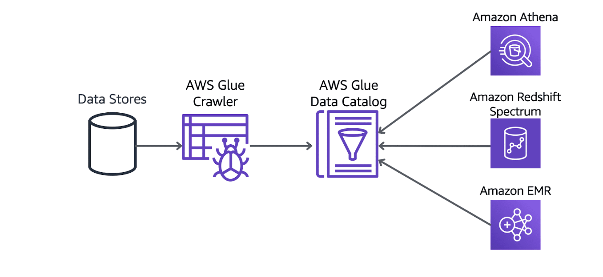
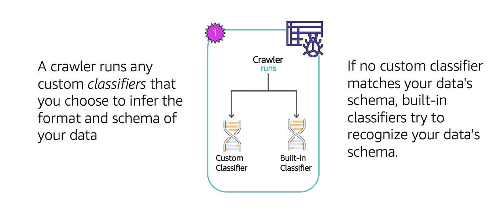
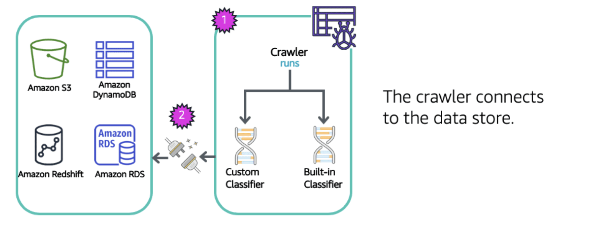
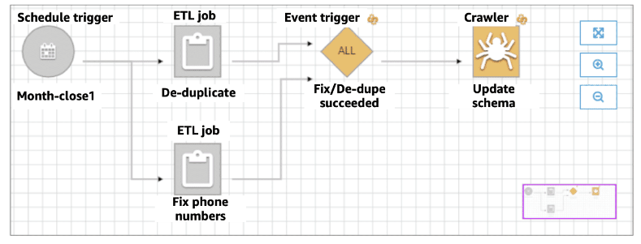
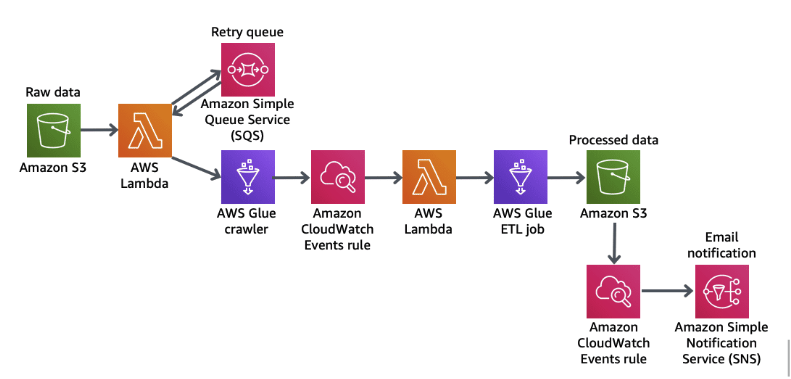
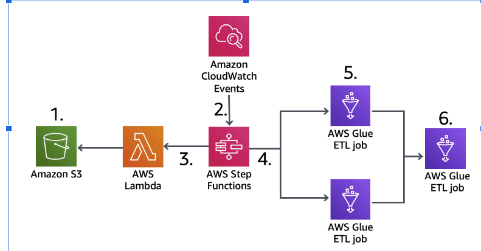

# AWS Glue
AWS Glue is a scalable, serverless data integration service that makes it easy to discover, prepare, and combine data for analytics, machine learning, and application development.

### The AWS Glue Data Catalog provides a unified view of your data
The AWS Glue Data Catalog is a persistent metadata store. It is a managed service that lets you store, annotate, and share metadata in the AWS Cloud in the same way you would in an Apache Hive metastore.

Each AWS account has one AWS Glue Data Catalog per AWS Region. It provides a uniform repository where disparate systems can store and find metadata to keep track of data in data silos and use that metadata to query and transform the data. To retrieve data from the AWS Glue Data Catalog, you can use Amazon Athena, Amazon EMR, and Amazon Redshift Spectrum.

## Populating the AWS Glue Data Catalog
**Step 1. A crawler runs any custom classifiers that you choose to infer the format and schema of your data.**

A classifier recognizes the format of your data and generates a schema. It returns a certainty number between 0.0 and 1.0, which helps crawlers determine if there is a match.
 
AWS Glue provides a set of built-in classifiers, but you can also create custom classifiers. AWS Glue invokes custom classifiers first, in the order that you specify in your crawler definition. Depending on the results that are returned from custom classifiers, AWS Glue might also invoke built-in classifiers.

**Step 2. The crawler connects to the data store.**

After AWS Glue connects to a JDBC data store, it must have permission from the data store to perform operations. The username you provide with the connection must have the required permissions or privileges. For example, a crawler requires SELECT privileges to retrieve metadata from a JDBC data store. Likewise, a job that writes to a JDBC target requires the necessary privileges to INSERT, UPDATE, and DELETE data into an existing table.

Crawlers can crawl the following data stores through a JDBC connection:
- Amazon Redshift
- Amazon RDS and Amazon Aurora
- MariaDB, Microsoft SQL Server, MySQL, Oracle, PostgreSQL
- Publicly accessible databases
Crawlers can crawl the following data stores through their respective native interfaces:
- Amazon S3
- Amazon DynamoDB

**Step 3: The inferred schema is created for your data.**

If the classifier recognizes the format of the data, it generates a schema. If a classifier returns certainty=1.0 during processing, it indicates that it's 100 percent certain that it can create the correct schema. AWS Glue then uses the output of that classifier. If no classifier returns certainty=1.0, AWS Glue uses the output of the classifier that has the highest certainty. If no classifier returns a certainty greater than 0.0, AWS Glue returns the default classification string of UNKNOWN.

**Step 4: The crawler writes metadata to the AWS Glue Data Catalog.**

A table definition contains metadata about the data in your data store. The table is written to a database, which is a container of tables in the AWS Glue Data Catalog. Attributes of a table include classification, which is a label created by the classifier that inferred the table schema.

## If you need simplified ETL without maintaining a cluster, use AWS Glue
AWS Glue recommends and generates ETL code to transform your source data into target schemas.
- Fully managed, cost effective, pay only for the resources consumed.
- Under the hood it is serverless spark environment.

### Data Source
Glue can natevely support following datastore using JDBC protocol
- Amazon Redshift, Amazon Redshift
- MariaDB, Microsoft SQL Server, MySQL, Oracle, PostgreSQL(Non AWS DBs)
- S3 (Without JDBC)

### Transform script
- AWS Glue can generate ETL code in Scala or Python to extract data from the source and transform data. 
- You can also provide your own script in the AWS Glue console or API.
- Can provision additional DPU(Data processing Units) to increase performance of underlying spark job.
- Error report to Cloud Watch, could tie into SNS for notification
- Transform, clean and Enrich data.
-  Transformation:
    - Bundeled Transforamtion (DropFeild, DropNullField, Filter, Join, Map)
    - Machine Learning Transforamtion
    - Format conversion (CSV, JSON, Avro, Parquet, ORC, XML)
    - Apache Spark Transformations (K-means)

### Data target
Once the data is transformed to match the target schema, the data is loaded into the target datastore.
Target can be:
- S3
- JDBC (Redshift, RDS)
- Metadata - Glue Data Catalog 

### Data catalog
The AWS Glue Data Catalog contains table definitions and metadata that is required to define ETL jobs. You use this metadata when you define a job to transform your data.

### AWS Glue triggers
A trigger can be one of the following types:
- Schedule
    - A time-based trigger based on cron.
- Job events (conditional)
    - An event-based trigger that fires when a previous job or multiple jobs satisfy a list of conditions. You provide a list of job events to watch for when their run state changes to succeeded, failed, stopped, or timeout. This trigger waits to fire until any or all the conditions are satisfied.
- On-demand
    - The trigger fires when you start it. As jobs complete, any triggers watching for completion are also fired and dependent jobs are started.
- Other AWS Services:
    - You can use Amazon CloudWatch Events, AWS Lambda, or AWS Step Functions to trigger an AWS Glue workflow. 

*Hive let you run SQl like query from EMR. The Glue data catalog can serve as Hive metastore. You can import Hive metastore in Glue*

### AWS Glue Development Endpoints
- If a Glue job doesn't need to run in your virtual private cloud (VPC) subnet—for example, transforming data from Amazon S3 to Amazon S3—no additional configuration is needed.
- If a job needs to run in your VPC subnet—for example, transforming data from a JDBC data store in a private subnet—AWS Glue sets up elastic network interfaces that enable your jobs to connect securely to other resources within your VPC.
- All JDBC data stores that are accessed by the job must be available from the VPC subnet. To access Amazon S3 from within your VPC, a VPC endpoint is required.
- A job or development endpoint can only access one VPC (and subnet) at a time. If you need to access data stores in different VPCs, you have the following options:
    - Use VPC peering to access the data stores.
    - Use an Amazon S3 bucket as an intermediary storage location.

## Security
- Encryption at Rest
    - Metadata stored in the AWS Glue Data Catalog
    - Data Written to S3
    - server-side encryption setting (SSE-S3 or SSE-KMS) that is passed as a parameter to your AWS Glue ETL
    - Encrypt connection passwords (JDBC connection)
    - Encrypt data written by AWS Glue
        - encrypted Amazon CloudWatch Logs
        - targets (Amazon S3)
- IAM (Identity and access management) for access control

## Glue Anit-Pattern
- Multiple ETL Enginer
    - Glue ETL is based on Spark
    - If you want to use other engines (Hive,Pig, etc ) Data Pipeline EMR would be a better fit.

## Using Workflows in AWS Glue
A workflow is a container for a set of related jobs, crawlers, and triggers in AWS Glue. The diagram shown below illustrates an example of a workflow. This workflow is started by a schedule trigger, which starts two AWS Glue ETL jobs. Upon successful completion of both jobs, an event trigger starts a crawler.

    

## Automating AWS Glue ETL jobs with AWS Lambda

   

The architecture shown above uses Lambda to trigger an ETL workflow. Here are the general steps of the architecture: 
- First, you build a data lake with Amazon S3 as the primary data store. Ingested data lands in an Amazon S3 bucket that we call the raw zone. 
- To make that data available, you have to catalog its schema in the AWS Glue Data Catalog. You can do this using a Lambda function invoked by an Amazon S3 trigger to start an AWS Glue crawler that catalogs the data. To handle errors with Lambda, this architecture uses an Amazon Simple Queue Service (Amazon SQS) queue for  event debugging and retries. 
- When the AWS Glue crawler is finished creating the table definition, you invoke a second Lambda function using a CloudWatch Events rule. This step starts an AWS Glue ETL job to convert the data to Apache Parquet format.
- The AWS Glue ETL job stores the converted data into the Amazon S3 bucket that we call the processed zone.
- As soon as the ETL job finishes, another CloudWatch Events rule sends you an email notification using an Amazon Simple Notification Service (Amazon SNS) topic. This notification indicates that your data was successfully processed.

## Using Step Functions with AWS Glue

  

In the diagram above, the services are orchestrated together by AWS Step Functions. 
- First, Amazon S3 acts as the landing zone for all ingested data. In this example, this architecture is used to combine two different data sets, one consisting of sales data and the other consisting of marketing data. 
- CloudWatch Events schedules the AWS Step Functions state machine to run weekly. 
- When the Step Functions state machine is triggered by the CloudWatch Event, it confirms the availability of the datasets through a Lambda function 
- The Step Functions state machine will then begin ETL job orchestration. 
- Step Functions will start two AWS Glue ETL jobs in parallel. One AWS Glue ETL job will begin to process sales data, while the other begins to process marketing data. 
- After the two AWS Glue ETL jobs run, another AWS Glue ETL job combines the two data sets. 

## AWS Glue Studio
- Visual interface for ETL workflow
- Visual Job Editor
    - Create DAG's for complex workflow
    - Source includes S3, Kinesis, Kafka and JDBC
    - Transform/ sample/ join
    - Support Partitioning
- Visual job Dashboard

## AWS Glue DataBrew
- A visual data preparation tool
- Input from S3, data warehouse
- Over 250 ready-made transformation
- You can create receipe of transformation
- Security
    - Can integrate with KMS(with customer master key only)
    - SSL in transit
    - IAM can restrict who can do what
    - Cloudwatch and CloudTrail

## AWS Glue Elastic View
- Build Materialized view from Aurora, RDS, DynamoDB
- Those view can be used by Redshift, ElasticSearch, S3, DynamoDB, Aurora and RDS
- SQL Interface
- Handles any copying or combining/replicating data needed
- Monitors for changes and continously data updates
- Serverless

## Use Cases
- Build event-driven ETL (extract, transform, and load) pipelines
- Create a unified catalog to find data across multiple data stores
- Create, run, and monitor ETL jobs without coding (AWS Glue Studio)
- Explore data with self-service visual data preparation (AWS Glue DataBrew)
- Build materialized views to combine and replicate data (in preview) (AWS Glue Elastic Views) 

