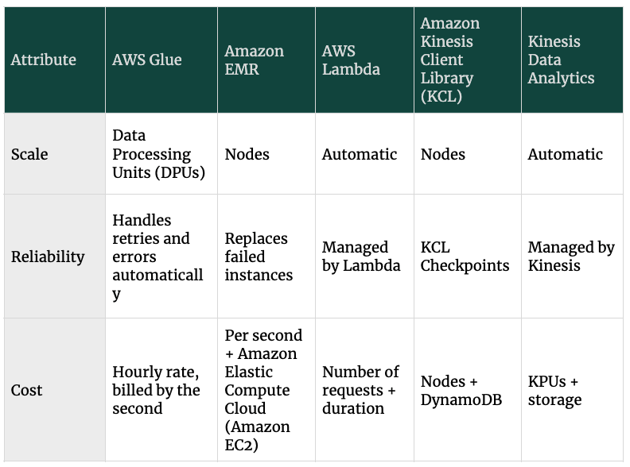

# Processing
This domain consists of three subdomains:
1. Determine appropriate data processing solution requirements
2. Design a solution for transforming and preparing data for analysis
3. Automate and operationalize a data processing solution

**ETL helps you transform, flatten, and enrich data from source to target. The goal is to:** 
- Handle terabytes and petabytes of data
- Simplify querying disparate data sets
- Combine existing and legacy data with modern data sets
- Prepare data for machine learning

However, ETL can be challenging. Here are some of the issues that we may experience:
- Data volumes may grow 
- Additional data sources may be added 
- A large proportion of ETL is hand-coded
- Data formats may change over time 
- Target schemas may change

## Review the use cases for each of the AWS ETL services
AWS offers several services to help us to perform ETL. We need to choose the right ETL tool for our workload requirements. 

**AWS Glue**

Serverless ETL that simplifies the process of maintaining and running jobs. AWS Glue is Apache Spark-based.

**Amazon EMR**

Provides you with lower-level access to your Hadoop environment and greater flexibility in using tools beyond Spark

**AWS Lambda**

Provides real-time stream and file processing and is often used to replace cron jobs.

**Amazon Kinesis-enabled**

Kinesis Data Firehose and Kinesis Data Analytics are integrated with AWS Lambda to perform streaming ETL.

To ensure that your ETL requirements are met, you'll want to assess additional design considerations, such as scalability, reliability, and the cost of the ETL tooling. This chart compares AWS Glue, Amazon EMR, AWS Lambda, and Amazon Kinesis-enabled applications to evaluate them on these characteristics. 

## Categorizing batch and streaming ETL services
It's important to remember that we can't use every tool for every use case. Review the following services to see how they're used for batch or streaming ETL. 

- Batch ETL
    - AWS Glue
    - Amazon EMR
- Streaming
    - AWS Lambda
    - Amazon Kinesis enabled
    - Amazon EMR

## Use orchestration to create repeatable workflows
Orchestrating multiple ETL jobs will allow us to automatically trigger and track each step in a workflow, and retry when there are errors. This allows us to create repeatable workflows, and identify and recover failed jobs more easily. To understand how to orchestrate ETL jobs in a pipeline,