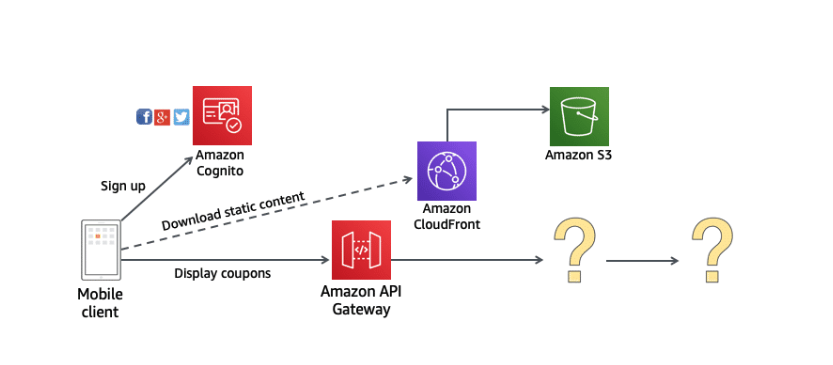

# DynamoDB
## Problem 
A company has developed a popular mobile app that offers coupons for registered local businesses within the user's vicinity. They want to run promotions often, so they need to ensure that the storage system that manages coupon information can scale in a cost-efficient manner to deal with increased volume in traffic during promotional events. Coupon data is often small in size, but it's imperative to provide that data at a low latency and high throughput. 

As shown in the architecture below, the company is currently using Amazon Cognito for user authentication and authorization, Amazon S3 to display static information like images, and Amazon CloudFront to optimize delivery of that static content. The company knows they want to interface with their backend AWS resources using an Amazon API Gateway.

Given this information, what is the best storage option for this architecture?

## DynamoDB Table
A table in DynamoDB is a collection of items; each item is composed of one or more attributes. You must specify a primary key for the table.

DynamoDB supports two types of primary keys:
- A partition key is a simple primary key, with one attribute, also known as the hash attribute. DynamoDB uses the partition key's value as input to an internal hash function. The output from the hash function determines the partition, or physical storage, internal to DynamoDB in which the item will be stored.
- This second type of key is a composite primary key, which contains both a partition key and a sort key. All items with the same partition key are stored together, in sorted order by sort key value. The sort key is also known as the range attribute. It gives you additional flexibility when querying your data. You can add any number of items to a table. The maximum size of an item is currently 400 KB.

## Secondary Indexes
You can create one or more secondary indexes on a table. A secondary index lets you query the data in the table using an alternate key, in addition to queries against the primary key. DynamoDB doesn't require that you use indexes, but they give your applications more flexibility when querying your data. After you create a secondary index on a table, you can read data from the index in much the same way as you do from the table.

DynamoDB supports two kinds of indexes:
- **Global secondary index** – An index with a partition key and sort key that can be different from those on the table.
- **Local secondary index** – An index that has the same partition key as the table, but a different sort key.

*Global secondary indexes (GSI) allow the partition key and optional sort key to differ from those on the base table. A GSI is considered "global" because queries on the index can span all the data in the base table, across all partitions. GSIs provide the most query flexibility.*

*Local secondary indexes (LSI) use the same partition key as the base table but allow you to specify a different sort key when required.  LSI is "local" in the sense that the data in LSIs is organized by the same partition key as the base table, but with a different sort key. Scroll down to review more information on LSIs and GSIs.*

*Each table in DynamoDB has a quota of 20 global secondary indexes (default quota) and 5 local secondary indexes.*

### Local secondary index
- You can have only 5 LSIs per base table.
- You can select a different sort key than the base table. You cannot change the partition key.
    - All attributes from the base table are included in the index.
    - Queries can return all attributes of the base table.
- LSIs are stored as part of the base table.
    - This means that LSIs share the provisioned throughput settings of the base table.
- LSIs:
    - Can only be created when a table is created
    - Cannot be deleted
    - Support both eventual consistency and strong consistency
    - Limit the total size of an item collection to 10 GB
        - The item collection includes all items that share the same partition key value.

### Global secondary index
- You can have up to 20 GSIs per base table.
    - The key is to limit the number as much as possible.
- You can select a partition key and sort keys that differ from the base table.
    - Key values do not need to be unique.
- You can choose which attributes are included in the index. This is called projection.
    - Queries only return attributes that are projected into the index.
- GSIs are stored separately from the base table. This means that you can customize the provisioned throughput settings for each index.
- GSIs: 
    - Can be created at any time
    - Can be deleted
    - Only support eventual consistency

## DynamoDB Streams
DynamoDB Streams is an optional feature that captures data modification events in DynamoDB tables. The data about these events appear in the stream in near-real time, and in the order that the events occurred.

If you enable a stream on a table, DynamoDB Streams writes a stream record whenever one of the following events occurs:
- A new item is added to the table: The stream captures an image of the entire item, including all of its attributes.
- An item is updated: The stream captures the "before" and "after" image of any attributes that were modified in the item.
- An item is deleted from the table: The stream captures an image of the entire item before it was deleted.

Each stream record also contains the name of the table, the event timestamp, and other metadata. Stream records have a lifetime of 24 hours; after that, they are automatically removed from the stream.

## Supported data types
- Scalar: number, string, binary, Boolean, and null.
- Document Types: list and map
- Set Types: string set, number set, and binary set

## DynamoDB's consistency model

DynamoDB uses a consistency model to achieve lightning-fast read operations. When reading data from DynamoDB, users can specify which consistency model they require.
- Eventually consistent reads (the default) – The eventual consistency option **maximizes read throughput**. When a read request is sent, the first response is immediately sent back. This can result in stale data. If you repeat your read request after a short time, the response should return the latest data. 
- Strongly consistent reads — When you request a strongly consistent read, DynamoDB returns a response with the most up-to-date data, reflecting the updates from all prior write operations that were successful. This ensures that you will never have stale data returned. However, there is a cost and increase in latency you will need to factor in.

## Table Class
- DynamoDB Standard table (default)
- DynamoDB Standard-Infrequent Access (good for application logs, old social media posts, e-commerce order history, and past gaming achievements)

## DynamoDB ACID transactions

DynamoDB also supports ACID-compliant transactions using transactional read and write APIs.

**ACID transactions** – DynamoDB transactions provide developers atomicity, consistency, isolation, and durability (ACID) across one or more tables within a single AWS account and Region. You can use transactions when building applications that require coordinated inserts, deletes, or updates to multiple items as part of a single logical business operation.

## DynamoDB cost and performance

DynamoDB has two capacity modes that come with specific billing options for processing reads and writes on your tables: on-demand and provisioned.

With **on-demand capacity mode**, you don’t need to specify how much read and write throughput you expect your application to perform, because DynamoDB instantly accommodates your workloads as they ramp up or down. 

With **provisioned capability mode**, you specify the number of reads (RCUs) and writes (WCUs) per second that you expect your application to require. 1 RCU represents one strongly consistent read or 2 eventually consistent reads per second for an item up to 4 KB in size. 1 WCU represents one write per second for an item up to 1 KB in size. You can provision any amount of throughput to a table and use auto scaling to automatically adjust your table’s capacity based on the specified utilization rate to ensure application performance while reducing costs.

*Throughput can be exceeded temporarily using “burst credit” If burst credit are empty, you’ll get a
ProvisionedThroughputException*

## DynamoDB global tables

DynamoDB global tables allow you to specify multiple AWS Regions where you want a table to be available. DynamoDB performs all tasks necessary to create identical tables in these regions and propagate ongoing data changes to all of them.

Any changes made to any item in any replica table will be replicated to all of the other replicas within the global table. In a global table, a newly written item, such as the one you see in the diagram above, is usually propagated to all replica tables within seconds. 

To help ensure eventual consistency, DynamoDB global tables use a last-writer-wins reconciliation between concurrent updates, in which DynamoDB makes a best effort to determine the last writer.

If a single AWS Region becomes isolated or degraded, your application can redirect to a different Region and perform reads and writes against a different replica table. You can apply custom business logic to determine when to redirect requests to other regions. 

## DynamoDB
Amazon DynamoDB is a fully managed NoSQL database service that provides fast and predictable performance with seamless scalability. DynamoDB also offers encryption at rest, which eliminates the operational burden and complexity involved in protecting sensitive data. You can scale up or scale down your tables' throughput capacity without downtime or performance degradation.

DynamoDB allows you to delete expired items from tables automatically to help you reduce storage usage and the cost of storing data that is no longer relevant.

## Partitions and Data Distribution
DynamoDB is optimized for uniform distribution of items across a table's partitions, no matter how many partitions there may be. It is recommend that you choose a partition key that can have a large number of distinct values relative to the number of items in the table.

In a DynamoDB table, there is no upper limit on the number of distinct sort key values per partition key value. If you needed to store many billions of Dog items in the Pets table, DynamoDB would allocate enough storage to handle this requirement automatically.

## DynamoDB API
- DeleteItem – Deletes a single item from a table
- BatchWriteItem - Deletes up to 25 items from one or more tables
- UpdateItem - Modifies one or more attributes in an item
- GetItem - Retrieves a single item from a table
- BatchGetItem - Retrieves up to 100 items (Up to 16 MB of data) from one or more tables
- PutItem - Writes a single item to a table
- BatchWriteItem - Writes up to 25 items to a table. 
- DeleteTable
- Query:
    - PartitionKey value (must be = operator)
    - SortKey value (=, <, <=, >, >=, Between, Begin) optional
    - FilterExpression to further filter (client side filtering)
    - Return upto 1 MB data OR number of items specified in Limit
    - Able to do pagination on the results
- Scan
    - Retrieves all items in the specified table or index.
    - Returns up to 1 MB of data use pagination to keep on reading
    - Consumes a lot of RCU
    - For faster performance, use parallel scans
        - Multiple instances scan multiple partitions at the same time
        - Increases the throughput and RCU consumed
        - Limit the impact of parallel scans just like you would for Scans

## DynamoDB - DAX (DynamoDB Accelerator)
Amazon DynamoDB is designed for scale and performance. In most cases, the DynamoDB response times can be measured in single-digit milliseconds. However, there are certain use cases that require response times in microseconds. For these use cases, DynamoDB Accelerator (DAX) delivers fast response times for accessing eventually consistent data.

- Seamless cache for DynamoDB, no application re-write
- Writes go through DAX to DynamoDB
- Micro second latency for cached reads & queries
- Solves the Hot Key problem (too many reads)
- 5 minutes TTL for cache by default
- Up to 10 nodes in the cluster
- Multi AZ (3 nodes minimum recommended for production)
- Secure (Encryption at rest with KMS, VPC,IAM, CloudTrail…)

## DynamoDB Streams
- Changes in DynamoDB (Create, Update,Delete) can end up in a DynamoDB Stream
- This stream can be read by AWS Lambda, and we can then do:
    - React to changes in real time (welcome email to new users)
    - Create derivative tables / views
    - Insert into ElasticSearch
- Could implement Cross Region Replication using Streams
- Stream has 24 hours of data retention
- Configurable batch size (up to 1,000 rows, 6 MB)

## DynamoDB Streams Kinesis Adapter
- Use the KCL library to directly consume from DynamoDB Streams
- You just need to add a “Kinesis Adapter” library
- The interface and programming is exactly the same as Kinesis Streams
- That’s the alternative to using AWS Lambda

## DynamoDB TTL (Time to Live)
After enabling TTL on a table, a per-partition scanner background process automatically and continuously evaluates the expiry status of items in the table.
- Enabling, disabling, or changing TTL settings on a table can take approximately one hour.
- You cannot reconfigure TTL to look for a different attribute. You must disable TTL, and then reenable TTL with the new attribute going forward.
- When you use AWS CloudFormation, you can enable TTL when creating a DynamoDB table.
- You can use AWS Identity and Access Management (IAM) policies to prevent unauthorized updates to the TTL attribute on an item or the configuration of TTL.
- Consider whether you need to do any post processing of deleted items via Amazon DynamoDB Streams, such as archiving items to an Amazon S3 data lake. The streams records of TTL deletes are marked as system deletes instead of normal deletes, and you can filter for system deletes by using an AWS Lambda function. 
- Automatically delete an item after expiry date/time.
- There is no extra cost, deletions don't use WCU/RCU
- It is helpful to reduce storage and manage table size
- Adhere to regulatory norms
- DynamoDB typically deletes expired items within 48 hours of expiration
- Deleted item due to TTL are also deleted from GSI/ LSI

## DynamoDB - Security
- Data is redundantly stored on multiple devices across multiple facilities in an Amazon DynamoDB Region.
- DynamoDB encryption at rest provides an additional layer of data protection by securing your data in an encrypted table—including its primary key, local and global secondary indexes, streams, global tables, backups, and DynamoDB Accelerator (DAX)
- Supported Encryptions:
    - AWS owned Key (Default)
    - AWS Managed Key (AWS KMS)
    - Customer Managed Key
- IAM to manage access permissions and implement security policies for both Amazon DynamoDB and DynamoDB Accelerator (DAX)
- VPC endpoint available to access DynamoDB without internet
- Encryption in transit using SSL/TLS

## Backup & Restore
- Fully Managed: Backups are automatically encrypted, cataloged, easily discoverable, and retained until you explicitly delete them.
- Easy to Use: Built in to the DynamoDB console, you can enable PITR(Point in Time Recovery) or create, restore, and delete backups easily with a single click.
- Create as many backups for tables of any size, and retain those backups as long as you need them. Backup operations complete in seconds.
- No Performance Impact: ackup, and restore do not consume any table provisioned capacity. These can run anytime and have no impact on the performance and availability of your production applications.

## Global table
- Global tables eliminate the difficult work of replicating data between Regions and resolving update conflicts.
- Read and write locally, access your data globally
- Performance as data reading locally
- Availability, durability, and multi-Region fault tolerance
- Consistency and conflict resolution